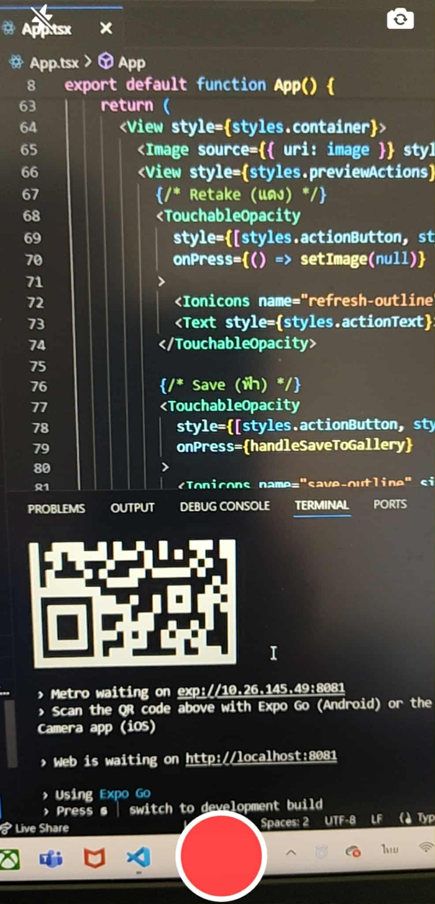
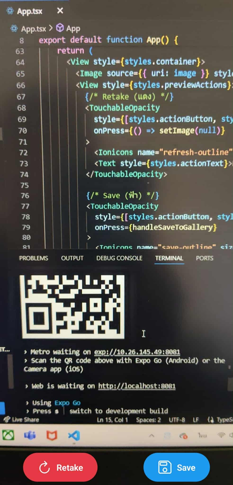

# React Native Camera & Media Library App

แอปตัวอย่างสำหรับ **ถ่ายรูปด้วยกล้อง** และ **บันทึกรูปลง Media Library** บน React Native (Expo) รองรับการสลับกล้องหน้า-หลัง และแฟลช

## Features

- ขอ **Permission** กล้องและ Media Library
- ถ่ายรูปด้วยกล้องหน้า / หลัง
- เปิด/ปิดแฟลช
- แสดง preview ของรูปที่ถ่าย
- บันทึกรูปลง Gallery
- Retake หรือ Save รูป

---

## ตัวอย่าง UI ที่ได้

Camera preview และปุ่มควบคุม

  
  

---

## วิะีสร้างโปรเจกต์

npx create-expo-app@latest camera-app --template blank-typescript

## ติดตั้งไลบรารี
- cd camera-app
- npx expo install expo-camera expo-media-library

## เรียกใช้แอป
npx expo start

จากนั้นสแกนโค้ด QR ด้วย Expo Go
